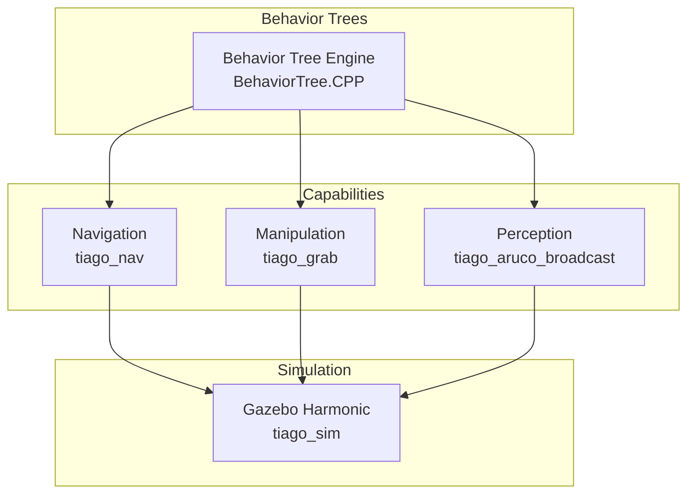

<h1 align="center">
  
  <br/>
  DelibFlow
  <br/>
  <sub>Behavior Tree Framework for TIAGo Robots</sub>
</h1>

<p align="center">
  <a href="https://github.com/arab-meet/Bt/actions/workflows/ros2.yaml"></a>
  
  
  
  
</p>

> [!WARNING]
> This is an experimental, work-in-progress repository!

---

## ✨ Introduction

**DelibFlow** is a ROS 2 framework for orchestrating complex robot behaviors using **Behavior Trees (BTs)**. It integrates high-level decision-making with standard ROS 2 stacks for Navigation, Manipulation, and Perception on PAL Robotics' TIAGo platform.

<p align="center">
  
</p>

---

## 🏗️ System Architecture



---

## 📦 Tech Stack & Requirements

| Requirement | Version / Details |
|-------------|-------------------|
| **ROS 2** | Jazzy Jalisco |
| **Gazebo** | Harmonic |
| **BehaviorTree.CPP** | v4.x |
| **Nav2** | latest |
| **Python** | 3.10+ |
| **Docker** | (Optional) for containerized builds |

### Third-Party Libraries
- `BehaviorTree.CPP`
- `nav2_behavior_tree`
- PAL Robotics TIAGo packages

---

## 📁 Repository Structure

```
DelibFlow/
├── docs/                   # Sphinx Documentation
├── tiago_aruco_broadcast/  # 📷 Perception (ArUco Detection)
├── tiago_demos/            # 🧠 Behavior Tree Demos
├── tiago_grab/             # 🦾 Manipulation
├── tiago_nav/              # 🧭 Navigation (Nav2)
├── tiago_sim/              # 🎮 Simulation (Gazebo)
├── tiago_slam/             # 🗺️ SLAM
└── ThirdParty/             # External Dependencies
```

---

## 🚀 Getting Started

### 1. Clone & Setup

```bash
mkdir -p ~/bt_ws/src && cd ~/bt_ws/src
git clone https://github.com/arab-meet/Bt.git
cd Bt && ./setup_third_party_pkgs.sh
```

### 2. Build

```bash
cd ~/bt_ws
colcon build --symlink-install
source install/setup.bash
```

### 3. Launch Simulation

```bash
ros2 launch tiago_sim tiago_sim.launch.py
```

### 4. Run Capabilities

| Capability | Command |
|------------|---------|
| **Navigation** | `ros2 launch tiago_nav tiago_nav2.launch.py` |
| **SLAM** | `ros2 launch tiago_slam tiago_slam_toolbox.launch.py` |
| **Perception** | `ros2 launch tiago_aruco_broadcast aruco.launch.py` |

---

## 🐳 Docker (Optional)

A Docker environment is provided for reproducible builds:

```bash
cd docker_bt
docker compose up
```

---

## 📖 Documentation

Build and view the Sphinx documentation:

```bash
cd docs && make html
# Open docs/build/hybrid/index.html
```

---

## 📜 License

See the [LICENSE](LICENSE) file for details.

---

<p align="center">
  <sub>Built with ❤️ by the Arab Meet Community</sub>
</p>
