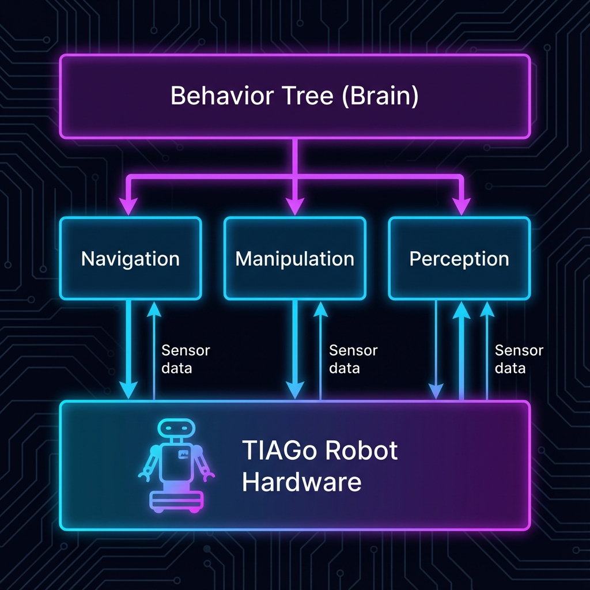

.. DelibFlow (Hybrid) documentation master file

DelibFlow Documentation (Hybrid Approach)
=========================================

.. note::
   **This is the Hybrid / Role-Based Prototype.**
   It organizes documentation by **Role** (User vs Developer) but keeps components highly connected.

Welcome to the DelibFlow documentation. This project provides a Behavior Tree-based framework for TIAGo robots, integrating Navigation, Manipulation, and Perception.

.. toctree::
   :maxdepth: 2
   :caption: Guides

   user-guide/index
   dev-guide/index
   theory/index

Indices and tables
==================

* :ref:`genindex`
* :ref:`modindex`
* :ref:`search`
