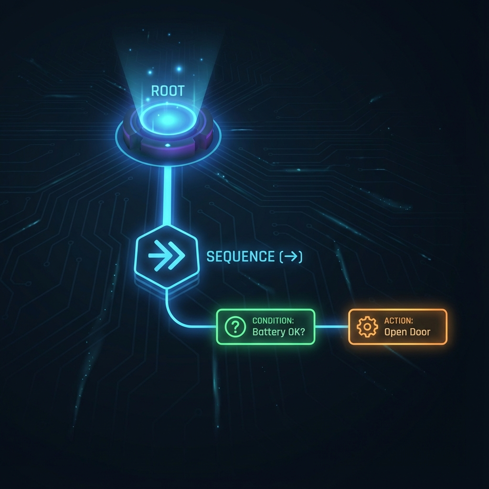

.. _ug-behavior-trees:

Behavior Trees (User Guide)
###########################

.. note::
   **See also:**
   
   * :doc:`Implementation Details <../dev-guide/behavior_trees>`
   * :doc:`Theoretical Background <../theory/behavior_trees>`

Overview
--------
Behavior Trees (BTs) are the core decision-making engine of this robot. They organize tasks into a tree structure of **Actions** and **Conditions**.

Executing a Tree
----------------
Trees are defined in XML files located in `tiago_demos/trees`.
To run a specific demo tree:

.. code-block:: bash

   ros2 launch tiago_demos bt_demo.launch.py tree:=pick_object_example.xml
