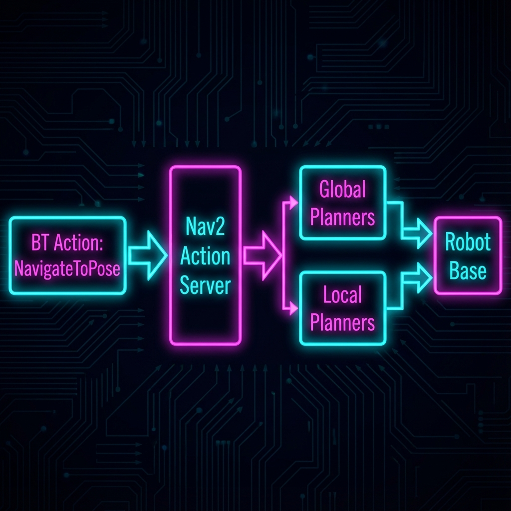

.. _ug-navigation:

Navigation (User Guide)
#######################

.. note::
   **See also:**
   
   * :doc:`Implementation Details <../dev-guide/navigation>`
   * :doc:`Theoretical Background <../theory/navigation>`

Overview
--------

The Navigation system enables the TIAGo robot to move autonomously in a mapped environment using the ROS 2 Navigation Stack (Nav2).

Prerequisites
-------------

Before running navigation, you must:

1. **Have a map** of the environment (see :ref:`creating-a-map`)
2. **Launch the simulation** or have the real robot running
3. **Start localization** (AMCL is started automatically with Nav2)

.. _creating-a-map:

Creating a Map
--------------

Step 1: Launch SLAM
^^^^^^^^^^^^^^^^^^^

.. code-block:: bash

    ros2 launch tiago_slam tiago_slam_toolbox.launch.py

This launches SLAM Toolbox which will create a map as the robot moves.

Step 2: Teleoperate the Robot
^^^^^^^^^^^^^^^^^^^^^^^^^^^^^^

.. code-block:: bash

    ros2 run teleop_twist_keyboard teleop_twist_keyboard

Drive the robot around to map the entire environment.

.. tip::
   - Move slowly for better map quality
   - Cover all areas you want the robot to navigate
   - Avoid rapid rotations which can cause drift

Step 3: Save the Map
^^^^^^^^^^^^^^^^^^^^^

.. code-block:: bash

    ros2 service call /slam_toolbox/save_map slam_toolbox/srv/SaveMap "{name: {data: my_map}}"

The map will be saved in the current directory as ``my_map.yaml`` and ``my_map.pgm``.

Running Navigation
------------------

Basic Usage
^^^^^^^^^^^

1. **Launch Navigation**:

   .. code-block:: bash

      ros2 launch tiago_nav tiago_nav2.launch.py

   .. note::
      By default, this uses the map from ``tiago_nav/maps/``. To use a custom map:
      
      .. code-block:: bash
      
         ros2 launch tiago_nav tiago_nav2.launch.py map:=/path/to/my_map.yaml

2. **Set Initial Pose** (in RViz):
   
   - Click "2D Pose Estimate"
   - Click on the map where the robot is
   - Drag to set orientation

3. **Send Navigation Goal** (in RViz):
   
   - Click "Nav2 Goal"
   - Click on destination
   - Drag to set target orientation

.. important::
   Always set the initial pose before sending navigation goals!

Using from Command Line
^^^^^^^^^^^^^^^^^^^^^^^

You can also send goals programmatically:

.. code-block:: bash

    ros2 topic pub /goal_pose geometry_msgs/PoseStamped "{
      header: {frame_id: 'map'},
      pose: {
        position: {x: 2.0, y: 1.0, z: 0.0},
        orientation: {x: 0.0, y: 0.0, z: 0.0, w: 1.0}
      }
    }"

Configuration
-------------

Key Parameters
^^^^^^^^^^^^^^

Navigation parameters are stored in ``tiago_nav/config/nav2_params.yaml``.

.. list-table::
   :header-rows: 1
   :widths: 30 40 30

   * - Parameter
     - Description
     - Default Value
   * - ``inflation_radius``
     - How far obstacles inflate
     - 0.55m
   * - ``max_vel_x``
     - Maximum forward velocity
     - 0.5 m/s
   * - ``min_vel_x``
     - Minimum forward velocity
     - -0.3 m/s
   * - ``max_vel_theta``
     - Maximum rotational velocity
     - 1.0 rad/s

Performance Tuning
^^^^^^^^^^^^^^^^^^

**For Faster Navigation**:

.. code-block:: yaml

    max_vel_x: 0.7
    max_vel_theta: 1.5

**For Safer Navigation** (tight spaces):

.. code-block:: yaml

    max_vel_x: 0.3
    inflation_radius: 0.7

.. warning::
   Always test parameter changes in simulation before deploying to real hardware!

Troubleshooting
---------------

Robot Doesn't Move
^^^^^^^^^^^^^^^^^^

**Symptom**: Goal is set but robot doesn't move.

**Solutions**:

1. Check if navigation is running:

   .. code-block:: bash

      ros2 node list | grep bt_navigator

2. Verify goal was received:

   .. code-block:: bash

      ros2 topic echo /goal_pose

3. Check for errors:

   .. code-block:: bash

      ros2 topic echo /diagnostics

Robot Gets Stuck
^^^^^^^^^^^^^^^^

**Symptom**: Robot oscillates or stops before reaching goal.

**Solutions**:

1. **Reduce inflation radius** if robot is too cautious
2. **Increase controller frequency** for better responsiveness
3. **Check costmap** in RViz to see what obstacles are detected

Path Planning Fails
^^^^^^^^^^^^^^^^^^^

**Symptom**: "Failed to create plan" error.

**Solutions**:

1. Goal is in an obstacle - choose different goal
2. Map is outdated - re-run SLAM
3. Inflation radius too large - reduce it

Robot Drifts from Path
^^^^^^^^^^^^^^^^^^^^^^^

**Symptom**: Robot doesn't follow the planned path accurately.

**Solutions**:

1. **Improve localization**: Ensure AMCL has enough features
2. **Tune DWB parameters**: Adjust path distance weight
3. **Check wheel odometry**: Verify encoder data

Advanced Features
-----------------

Recovery Behaviors
^^^^^^^^^^^^^^^^^^

Nav2 automatically triggers recovery behaviors when stuck:

1. **Clear costmap** - Removes temporary obstacles
2. **Spin** - Rotates in place to scan for path
3. **Back up** - Moves backwards to get unstuck

You can configure these in ``nav2_params.yaml`` under ``recoveries_server``.

Waypoint Following
^^^^^^^^^^^^^^^^^^

To navigate through multiple waypoints:

.. code-block:: bash

    ros2 action send_goal /follow_waypoints nav2_msgs/action/FollowWaypoints "{
      poses: [
        {pose: {position: {x: 1.0}}},
        {pose: {position: {x: 2.0, y: 1.0}}},
        {pose: {position: {x: 3.0}}}
      ]
    }"

Best Practices
--------------

1. **Always Map First**: Don't skip the mapping step
2. **Set Clear Initial Pose**: Accurate localization is critical
3. **Monitor in RViz**: Watch costmaps and path visualization
4. **Test Incrementally**: Try short distances before long ones
5. **Keep Maps Updated**: Re-map if environment changes significantly

Next Steps
----------

- :doc:`../dev-guide/navigation` - Customize Nav2 configuration
- :doc:`../theory/navigation` - Understand path planning algorithms
- :doc:`behavior_trees` - Integrate navigation into BT workflows
- :doc:`manipulation` - Combine navigation with manipulation
